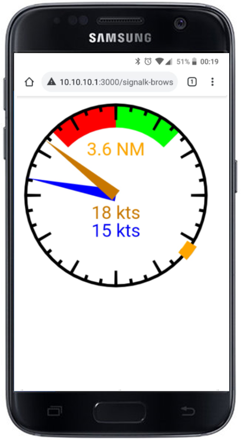

# signalk-browser

One-file tool that presents the 'self' data from a local SignalK engine. It converts units to nautical units, and it updates automatically. Multiple formats are possible: all data, a selection of operational data for display in a smart device, or a simple wind gauge for apparent and true wind.

Usage
- When installed as an NPM package within SignalK, install the package and restart the server. The Package will show up under Webapps.
- For standalone usage, in the file signalk-browser.html, adjust the variable mySignalkURL to reflect the IP of your SignalK server. The default is right for a typical Openplotter installation.
```
//
// Configure your signalk url:port below, like openplotter.myboat.local:3000 or 10.10.10.1:3000
//
var mySignalkURL = "10.10.10.1:3000"

```

Then, open the file in your browser.


With ?presentation=gauge, it shows a wind gauge with apparent and true wind, if available. Also, it features an aviation-style 'heading bug', that points to the next waypoint, and distance, if an active route is provided:



With ?presentation=display, it shows a selection of values in a way that does well on mobile devices:


With ?presentation=both, it shows both wind gauge and information display, oriented according to the device orientation. This is actually the default presentation format, when no preference is given.

By default, a 5 second timeout governs data items to be marked 'stale', striking the values out in the list, or not showing then in the gauge.
